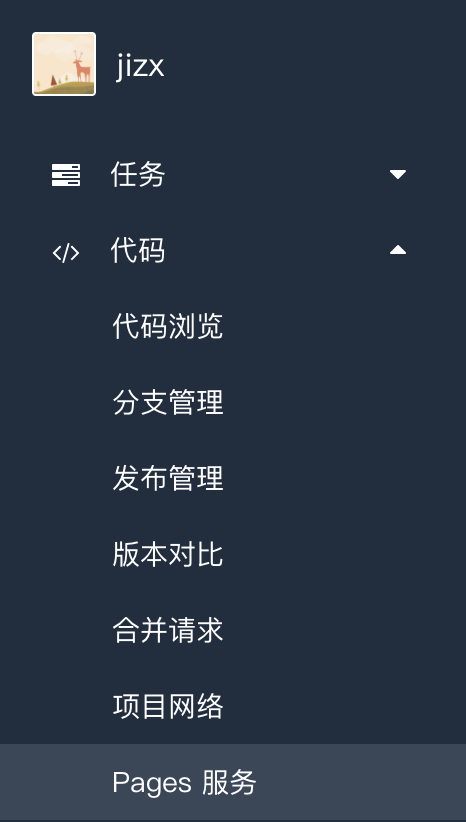
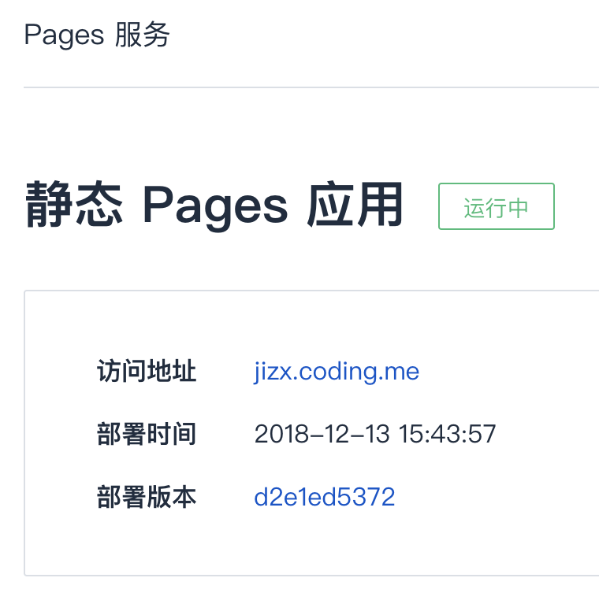
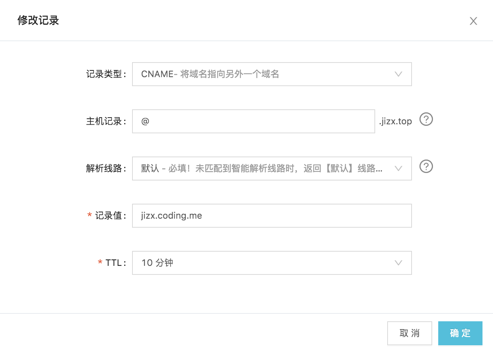

博客在搭建完成后进行了适当的SEO，然后我分别将站点提交了谷歌和百度进行收录，提交的是GitHub Pages的地址。然而，提交给谷歌后不久就被收录了，但是百度却迟迟没有收录。当时这个问题还一直找不到原因，直到我试图在百度站长平台检测自己网站Robots时，根据错误信息才发现百度爬虫无法抓取，因为GitHub禁掉了百度爬虫。

## 解决思路

这个问题的解决办法网上有几种说法，大致分为三种：

- 放弃将博客部署在GitHub上。
- 利用CDN。
- 同时部署到GitHub和Coding。


在知道这个问题的原因之后，第一时间想到的是就是搞一个云服务器，将博客部署到云服务器上。但是，考虑到云服务器只部署博客有点亏，而暂时也没有其他的东西需要用到云服务器，所以就放弃了，还是打算部署在GitHub上。 
第二种利用CDN来代理GitHub Pages上的博客的方法并不能很好的解决这个问题，因为如果附近的节点没有缓存，爬虫仍然会去爬取GitHub Pages上的内容。 
所以综合考虑，最后采取了第三种办法，同时部署到GitHub和Coding上，通过域名解析，将国内的请求解析到Coding上。


## 操作过程

### 部署到Coding

首先去Coding上注册个账号，在【个人设置】中配置一下SSH Key，之前部署过github的应该在home目录下有`.ssh/id_rsa.pub`，使用` cat ~/.ssh/id_rsa.pub` 获取公钥。然后使用`ssh -T git@git.coding.net`测试是否设置成功：

```
Coding 提示: Hello jizx, You've connected to Coding.net via SSH. This is a personal key.
jizx，你好，你已经通过 SSH 协议认证 Coding.net 服务，这是一个个人公钥
```


然后创建了一个`<username>`的仓库(**用户名，不是昵称**)，接着在hexo的配置文件`_config.yml`中添加该仓库的地址，如下所示。

```yaml
# Deployment
## Docs: https://hexo.io/docs/deployment.html
deploy:
- type: git
  repo: git@github.com:JizxGit/jizxgit.github.io.git
  branch: master
# 新的coding部署仓库
- type: git
  repo: git@git.dev.tencent.com:jizx/jizx.git
  branch: master
```

然后就可以通过hexo部署

```
hexo d
hexo g
hexo d
```

在【代码】项下有Pages服务，进入一键开启即可，



稍等一会儿后结果如下，可以看到博客的网址是`jizx.coding.me`，不过不是这样的话，就是你仓库名称不是用`<username>`创建的，博客会加载不出来：



### 设置域名

完成了博客的部署后，就需要去弄个域名并添加解析。我是在阿里云申请的域名，进入域名管理的界面，添加域名解析，设置如下：



### 域名绑定

域名解析成功后，并不能通过域名访问博客，需要分别在GitHub和Coding上绑定自己申请的域名。

其中Github，在博客的source目录下新建一个CNAME文件，文件写上自己申请的域名（不需要`http://`，`www`可有可无）并提交，即可完成GitHub上的绑定；

而Coding上的绑定则更加简单，在Pages服务页面，通过自定义域名更能进行绑定即可。绑定完成后，待域名的解析生效即可通过申请的域名访问到博客了。


参考：https://blog.whezh.com/baidu-collect-github/