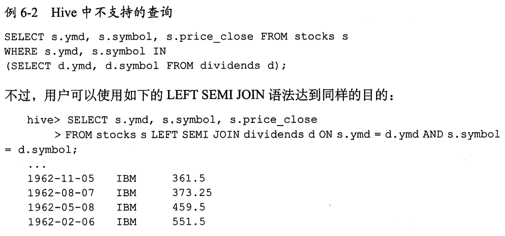

<Excerpt in index | 首页摘要> 

hive 的读书笔记，ing

<!-- more -->
<The rest of contents | 余下全文>


## TODO

-   [x] 第 3 章
-   [x] 第 4 章
    -   [ ] 4.4.2 自定义表的存储格式
    -   [ ] 4.6.7 
-   [x] 第 5 章
-   [x] 第 6 章
    -   [x] 6.9.2 分桶表的输入裁剪
-   [x] 第 7 章 视图
-   [ ] 第 8 章 粗略看了
-   [x] 第 9 章
    -   [ ] 9.5

头部寻址

Hadoop 每次指定的文件输入和输出路径都是**文件夹**


### hive 变量空间

| 命名空间 | 使用权限 | 详细描述                  |
| -------- | -------- | ------------------------- |
| hivevar  | rw       | 用户自定义变量（v0.8.0+） |
| hiveconf | rw       | hive相关配置属性          |
| system   | rw       | java定义的配置属性        |
| env      | r        | Shell环境属性             |

通常我们可以使用hive -e查看有关hivevar与hiveconf的描述：

**2、hivevar与hiveconf的作用域**

之前项目中涉及两个hive作业同时执行并需要传入相同key的参数，因此顾虑不清楚是否是线程安全。

结论先行：`hivevar`与`hiveconf`作用域都**是会话级别**的，言外之意就是如果两个并发同时跑的作业同时传入一个相同key但是value不相同的值的参数，**不会发生线程安全问题**。

**3、对于hivevar与hiveconf的使用**

`hiveconf` 变量取值必须要使用`hiveconf`作为前缀参数，具体格式如下:`${hiveconf:key} `

但是对于`hivevar`取值可以不使用前缀`hivevar`，具体格式如下：

-   使用前缀:   `${hivevar:key}`

-   不使用前缀:`${key}`


### CLI

注意：cli中 tab 会进行自动补全，而且输入流后面的字符会被认为是对提示的回复，因此会导致执行失败


`!`， 不用退出 hive CLI 即可使用shell 命令，在命令前加上感叹号即可：`! pwd ;`

注意：不支持交互式命令、管道命令、文件名模糊匹配功能，如`! ls *.hql`，查找的是`*.hql`文件而不是以`.hql`结尾的所有文件。


hive 中使用 hadoop 命令，只需要去掉`hadoop`这个关键字即可。而且更加高效，因此 hive 会在同一进程中执行这些命令，而不需要重新启动一个 JVM 实例。


以`--`开头的字符串是注释。


## 数据类型与定义

### hive 数据类型

| 分类     | 类型      | 描述                                           | 字面量示例                                                   |
| :------- | :-------- | :--------------------------------------------- | :----------------------------------------------------------- |
| 原始类型 | BOOLEAN   | true/false                                     | TRUE                                                         |
|          | TINYINT   | 1字节的有符号整数 -128~127                     | 1Y                                                           |
|          | SMALLINT  | 2个字节的有符号整数，-32768~32767              | 1S                                                           |
|          | INT       | 4个字节的带符号整数                            | 1                                                            |
|          | BIGINT    | 8字节带符号整数                                | 1L                                                           |
|          | FLOAT     | 4字节单精度浮点数1.0                           |                                                              |
|          | DOUBLE    | 8字节双精度浮点数                              | 1.0                                                          |
|          | DEICIMAL  | 任意精度的带符号小数                           | 1.0                                                          |
|          | STRING    | 字符串，变长                                   | “a”，’b’                                                     |
|          | VARCHAR   | 变长字符串                                     | “a”，’b’                                                     |
|          | CHAR      | 固定长度字符串                                 | “a”，’b’                                                     |
|          | BINARY    | 字节数组（v0.8.0+）                            |                                                              |
|          | TIMESTAMP | 时间戳，纳秒精度（v0.8.0+）                    | 122327493795                                                 |
|          | DATE      | 日期                                           | ‘2016-03-29’                                                 |
| 复杂类型 | ARRAY     | 有序的的同类型的集合                           | array(1,2)                                                   |
|          | MAP       | key-value,key必须为原始类型，value可以任意类型 | map(‘a’,1,’b’,2)                                             |
|          | STRUCT    | 字段集合,类型可以不同                          | struct(‘1’,1,1.0), named_stract(‘col1’,’1’,’col2’,1,’clo3’,1.0) |
|          | UNION     | 在有限取值范围内的一个值                       | create_union(1,’a’,63)                                       |


不存在最大长度限制的“字符串”，hive 支持无限长度的字符串

进行比较时，hive 会隐式地将类型转为较大的，因此是同类型间的比较


集合类型的问题可能会增大数据冗余的风险，也可能导致数据不一致，当数据发生改变时，冗余的拷贝数据可能无法进行相应的同步。优点是提升更高的吞吐量的数据。


### 文本文件的保存形式


### 分隔符在HIVE中的用途

| 分隔符     | 描述                                                         |
| ---------- | ------------------------------------------------------------ |
| \n         | 对于文本文件来说，每行都是一条记录，因此换行符可以分隔记录   |
| ^A(Ctrl+A) | 用于分隔字段(列)。在CREATE TABLE语句中可以使用八进制编码\001表示 |
| ^B(Ctrl+B) | 用于分隔ARRAY或者STRUCT中的元素，或用于MAP中键-值对之间的分隔。在CREATE TABLE语句中可以使用八进制编码\002表示 |
| ^C(Ctrl+C) | 用于MAP中键和值之间的分隔。在CREATE TABLE语句中可以使用八进制编码\003表示 |


>   Hive 中没有定义专门的数据格式，数据格式可以由用户指定，用户定义数据格式需要指定三个属性：列分隔符（通常为空格、”\t”、”\x001″）、行分隔符（”\n”）以及读取文件数据的方法。由于在加载数据的过程中，不需要从用户数据格式到 Hive 定义的数据格式的转换，因此，Hive 在加载的过程中不会对数据本身进行任何修改，而只是将数据内容复制或者移动到相应的 HDFS 目录中。

在创建 table 的时候，table 加载文件的时候就会按照下面格式匹配

```
row format delimited 
fields terminated by '\001' 
collection items terminated by '\002' 
map keys terminated by '\003'
lines terminated by '\n' 
stored as textfile;
```

`row format delimited `必须写在其他子句（不包括`lines terminated by`与`stored as textfile`）之前。

其实，`line terminated by`目前只支持`\n`，`stored as textfile`也很少用到。


### 数据校验

传统数据库是**写时模式**，即 数据在写入数据库的时候对模式（数据格式）进行检查

hive 不会在 数据加载时进行验证，而是在查询时进行，也就是**读时模式**

如果模式和文件内容不匹配，hive 容忍性非常好。

-   如果每行记录中字段个数少于对应的模式中定义的字段个数的话，缺失的字段以 null 填充
-   如果字段是数值型，但 hive 读取时发现存在非数值类型的字符串值的话，那些字段将会返回 null 值


## HiveQL基本语句

hive 不支持行级插入、更新、删除操作，也不支持事务。

hive   数据库的概念本质上只是表的一个目录或者命名空间。这样可以避免表名冲突。

如果没有显指定数据库，默认使用 default 数据库


### 数据库


```
show databases;
show databases like 'h.*';   # 支持正则
create database name LOCATION ‘/my/dir/’;   # 指定数据库目录

```

数据库可以的内容很少，只有`DBPROPERTIES`可以设置键值对属性，来描述这个数据库的属性信息，其他都是不可改的。

```
alert database name SET DBPROPERTIES ('edited-by'='jizx');
```


### 数据定义


### 分区表

通过载入数据的方式创建分区。将`$HOME/california-employees`   目录下的文件拷贝到分区目录下。

```
load data local inpath '${env:HOME}/california-employees'
into table emplyees
partition (country = 'US', state = 'CA')
```

也可以t通过 insert 的方法，也可以通过 `alert table...add partition`的方法


#### 查看分区

```
show partitions table_name;
describe extended table_name;   # 更详细的表信息
describe extended table_name PARTITION  (year=2019,month=1,day=2);   # 更详细的分区信息，可以看到 location 信息
```


### 外部分区表（最常见）

使用的目录组织习惯完全由我们自己定义。

```
alert table name ADD PARTITION(year=2019,month=9,day=2)
LOCATITION 'hdfs://master_server/data/log_messages/2012/01/02';
```

这种灵活性的优点是：我们可以用像 amazon s3 这样的廉价存储设备存储**旧的数据**，在 HDFS 中存储较新的数据。


### 删除表

```
drop table if exists table_name;
```

对于管理表，表的元数据和表内的数据都会被删除。


回收站功能

/user/$USER/.Trash目录下

```
fs.trash.interval=
```

检查点的时间间隔，单位是分钟。


如果不小心删除了管理表的话，先重建表，然后重建所需要的分区，再从`.Trash`目录中将误删的文件移动到正确的文件目录下。


### 修改表

会修改元数据，但不会修改数据本身

#### 重命名

```
alert table log_messages RENAME TO logmsgs;
```


#### 分区操作

添加

````
alert table log_messages ADD IF NOT EXISTS
PARTITION (year=2019,month=1,day=1) LOCATITION '/logs/2019/09/01'
PARTITION (year=2019,month=1,day=2) LOCATITION '/logs/2019/09/02'
PARTITION (year=2019,month=1,day=3) LOCATITION '/logs/2019/09/03'
````

>   0.8.0以上的 hive 可以在一个查询内同时增加多个分区

修改

```
alert table log_messages PARTITION (year=2019,month=1,day=3)
SET LOCATION 's3n://ourbucket/logs/2011/01/02'
```


删除

```
alert table log_messages DROP IF EXISTs PARTITION (year=2019,month=1,day=3);
```


#### 列操作

**修改列**

````
alert table log
CHANGE COLUMN hms new_hms INT
COMMENT '注释'
AFTER other_column;
````

想放在第一列的话，使用`FIRTST`代替`AFTER other_column`即可

**添加**

```
alert table log ADD COLUMN (
	app_name STRING COMMENT '注释',
	session STRING COMMENT '注释'
);
```


**删除或替换列**

其实就是将原本的全部的列信息删除掉，然后重新定义列信息。

````
alert table log REPLACE COLUMN (
	app_name STRING COMMENT '注释',
	session STRING COMMENT '注释'
);
````


**修改表属性**

可以修改或添加，但是无法删除

 ````
alert table log SET TBLPROPERTIES(
	'note' = '笔记内容'
);
 ````


### 查看表详细信息

 ` desc formatted test_table;`


## 优化

limit在CLI 中非常经常用到，为了避免执行整个查询语句，有一个配置属性可开启，对原数据进行抽样。

```
hive.limit.optimize.enable=true
hive.limit.row.max.size=1000000    # how much size we need to gurantee each row to have at least
hive.limit.optimize.limit.file=10  # 最多采样的文件数
```


缺点：有可能输入中有用的数据永远不会被处理到。


### 创建分区表

```
# 建表
> create table supply(id int, part string, quantity int) 
> partitioned by (int day);

# 添加分区
> alert table supply add partiton (day=20190909);

# 通过 where 选择分区
> select part,quantity from supply
> where day>=20190909 and quantity < 4;
```


多分区

```
> ...
> partition by (day int, state string, city string);
```

理想的分区方案不应该导致产生太多的分区和文件夹目录。

一个分区对应着包含多个文件的文件夹。因此如果存在数百个分区，每天就会创建好几万个文件。默认情况下，MapReduce 会将每个 job转为多个 task，每个 task 都是一个新的 JVM 实例，每个文件都会对应一个 task，因此 JVM 的开启和销毁可能会比实际处理数据的时间还要久。

好的分区方案应该保证分区数量的增长是**均匀的**。

### 分桶表TODO


### 为表增加列

SerDe 非常宽松，通过指定的分隔符从左向右将行分解成列

-   如果字段数比预期少，那么缺失的字段将返回 null
-   如果字段数比预期多，那么多出的字段将会被忽略


```
alert table student add columns (score string);
```


通过这种方法，无法在已有字段的开始或者中间增加字段


### 使用列存储表 TODO

以下两种情况适合列存储表

#### 重复数据，如 age，省市


#### 多列


### Map join

以下几种情况无法使用map join

```
Union Followed by a MapJoin
Lateral View Followed by a MapJoin
Reduce Sink (Group By/Join/Sort By/Cluster By/Distribute By) Followed by MapJoin
MapJoin Followed by Union
MapJoin Followed by Join
MapJoin Followed by MapJoin
```


相关配置

```
--是否自动转换为mapjoin
set hive.auto.convert.join = true;
--小表的最大文件大小，默认为25000000，即25M
set hive.mapjoin.smalltable.filesize = 25000000;
--是否将多个mapjoin合并为一个
set hive.auto.convert.join.noconditionaltask = true;
--多个mapjoin转换为1个时，所有小表的文件大小总和的最大值。
set hive.auto.convert.join.noconditionaltask.size = 10000000;
```


#### 确保多张小表使用 mapjoin

```sql
select /*+MAPJOIN(smallTableTwo)*/ idOne, idTwo, value FROM
  ( select /*+MAPJOIN(smallTableOne)*/ idOne, idTwo, value FROM
    bigTable JOIN smallTableOne on (bigTable.idOne = smallTableOne.idOne)                             
  ) firstjoin                                                            
  JOIN                                                                 
  smallTableTwo ON (firstjoin.idTwo = smallTableTwo.idTwo) 
```

除了添加 mapjoin提示，还需要设置两个参数

-   hive.auto.convert.join.noconditionaltask=true

    >   如果启用此参数，并且n向连接的表/分区的n-1个大小的总和<指定的大小，则该连接将直接转换为mapjoin（没有条件任务）。

-   hive.auto.convert.join.noconditionaltask.size=1000000

    >   如果n路联接的n个表/分区的n-1个大小的总和小于此大小，该连表将直接转换为mapjoin（没有条件任务）。 默认值为10MB。

https://cwiki.apache.org/confluence/display/Hive/LanguageManual+Joins


## 导入导出数据


### 动态分区插入

可以基于查询参数推断出需要创建的分区名称。SELECT 语句中的最后 2 列会对应到 PARTITION 中的分区名。

````
INSERT OVERWRITE TSBLE employees
PARTITION(country, state)
SELECT ..., se.cnty,se.st
FROM staged_employees se;
````


动静结合

```
INSERT OVERWRITE TSBLE employees
PARTITION(country = 'US', state)   # 静态分区键必须出现在动态分区键之前
SELECT ..., se.cnty,se.st
FROM staged_employees se
WHERE se.cnty = 'US';
```


### 单个查询语句中创建表并加装数据

这个功能不能用于外部表。

```
CREATE TABLE ca_employees
AS SELECT name, salary, address
FROM employees
WHERE se.state = 'CA';
```


### 导出数据

```
INSERT OVERWRITE LOCAL DIRECTORY '/tmp/employees'
select name
from employee
where se.state = 'CA'
```


## 查询

### select

`select sub[0] from table_name;` 查询**数组**类型的字段的第一个元素

`select ded[“state taxes”] from table_name;` 查询**map**类型的字段

`select address.city from table_name;` 查询**struct**类型的字段


使用正则表达式来指定列，所有以 price 开头的列

```
select `price.*` from stocks;
```


不允许使用多个 DISTINCT 函数

```
select count(DISTINCT ymd),count (DISTINCT volume) from stocks;
```


存在的 bug `count(DISTINCT col)`同时 col 是分区列时，会出现 bug


表生成函数

```
SELECT name, sub 
FROM udtf_test
LATERAL VIEW explode(subordinates) subView AS sub;
```

在这里LATERAL VIEW 是将 explode结果转换成一个视图subView,在视图中的单列列名定义为sub，然后在查询的时候引用这个列名就能够查到。


与时间相关的函数 ，输入可以是整数或者字符串类型。对于 0.8.0，可以接受 TIMESTAMP 类型的参数。


列别名 `SELECT  col as new_col FROM table_name`


对列的进一步处理，进行条件判断

```
Select  
    CASE 
     WHEN salary > 7 AND salary <10 THEN 'high'
     ELSE 'very high'
    END AS bracket 
FROM employees
```


最好将下面的设置添加到 hiverc 中，避免不必要的 `MapReduce`

```
set  hive.exec.mode.local.auto=true
```


### where


where 语句使用**谓词表达式**，谓词表达式结果为 true 时，相应的行将被保留和输出。

where 语句中并不能使用 select 语句中的别名，解决办法是使用嵌套 select 语句

```
SELECT e.* FROM
  ( select salary*(1- ded["Taxes"]) as new_salary
    FROM employees) e
WHERE round(e.new_salary) > 7000
```


#### 关于浮点数比较的陷阱

hive无法精确的表示 0.2，如果转为 float，实际数值是：0.2000001。如果转为 double，实际数值是：0.200000000001。

sql 语句中的浮点数，默认是 Double 类型的，比如下面的0.2

```
select * from name wheren high> 0.2
```

如果表的字段定义时是 Float 类型，就会出现比较上的问题。输出中会有=0.2 的。

Float字段会隐式转为 Double 类型，变成：0.20000001000000，因此会比 0.2 的double 类型0.200000000001大。 

因此会出现 `>0.2`的效果与`>=0.2`相同。


解决办法：

1.  将字段类型保存为 double，缺点是查询时内存消耗增多
2.  sql 中的数字显示指定类型`WHERE high > cast(0.2 AS FLOAT)`
3.  与钱相关的都避免使用浮点数


### GROUP BY 语句

having 语句用于聚合后再进行的条件过滤，避免了子查询

```
select avg(salary) From stocks
where ...
GROUP BY year(ymd)
HAVING avg(salary) > 50.0   # 对上面的聚合后的内容进行过滤
```


### join 语句

-   join on 只支持等值连接，也就是`a.col=b.col` ，不支持`a.col< b.col`

-   不支持在 on 子句中的谓词使用 OR

-   hive 假定从左到右边表依次变大，也可以在 SELECT 中添加`/*+STREAMTABLE(s)*/`

-   ```
    SELECT /*+STREAMTABLE(s)*/   s.ymd,s.symbol
    FROM stocks s JOIN dividends d ON ...
    ```

-   ON语句中的分区过滤条件在 OUTER JOIN 中是无效的，在 INNER JOIN 中是有效的 TODO（不太明白）

-   full outer join 将会返回所有表中符合 WHERE 语句条件的所有记录。如果任一张表的指定字段没有符合条件的值的话，那么就是用 NULL 值代替。


#### LEFT SEMI-JOIN

左半开连接会返回左边表的记录，前提是其记录对于满足 ON 语句中的判定条件。




#### map  join

0.7之前的需要在 SELECT 中添加标记来进行触发，如下面的内连接

```
SELECT /*+MAPJOIN(d)*/ s.ymd, s.symbol, d.dividend 
FROM stocks s JOIN dividends d ON s.ymd=d.ymd
WHERE s.symbol = 'AAPL'
```

0.7之后的版本，废弃这种标记，不过添加后同样是有效的。如果没有该标记，需要用户设置属性`hive.auto.convert.JOIN=true`，也可以配置小表的大小`hive.mapjoin.smalltable.filesize=25000000` 单位是字节


### ORDER BY 和 SORT BY

sort by 是局部的，order by 是全局的，比较费时。


### DISTRIBUTE BY与 CLUSTER BY

Distribute by 用来保证相同指定列的记录会分发到同一个 reducer 中。

如果DISTRIBUTE 与 SORT 语句中都涉及到相同的列，而且采用的是升序排序方式，那么这时 CLUSTER BY 等价于前面的两个语句。

CLUSTER BY 剥夺了 SORT BY 的并行性，但是这样可以实现输出的数据是全局排序的。


### 抽样查询

方式1

```
select * from numbers TABLESAMPLE(BUCKET 1 OUT OF 2 ON col1) s;
```

2表示将数据分散成几桶，1 表示选择第几桶


方式 2

```
select * from numbersflat TABLESAMPLE(0.1 PERCENT) s;
```

基于行数的，按照输入路径下的数据块百分比进行抽样。

-   不一定适合所有文件格式
-   抽样最小单元是一个 HDFS 数据块，如果标的数据大小 < 普通的块大小 128MB 的话，将返回所有行


### UNION ALL

hive中比较低的版本没有 union，只有 union all


## 视图

-   将复杂的多层子嵌套进行封装，类似于使用函数一样。
-   安全机制，不直接给用户访问敏感数据的原始表，而是提供给用户通过 where 限制了的视图。（目前 hive 并不支持，用户必须具有原始表的权限，视图才能工作）
-   可以理解为：hive 会先解析视图，然后使用解析结果来解析整个查询语句，不过查询优化器**可能会将视图和查询语句合并成一个单一的实际查询语句。**如果视图中包含 ORDER BY 或者 LIMIT，则会先解析视图。
-   通过 show tables 来查询视图，没有 show views 这样的语句


describe 和describe extended 可以显示视图的元数据信息

## 索引


## 其他

### 数据的导入与导出

1）加载到普通表

加载本地文本文件内容（要与hive表字段分隔符顺序都要一致）

    load data local inpath '/home/hadoop/orders.csv' overwrite into table orders;

如果数据源在HDFS上，

```
load data inpath 'hdfs://master:9000/user/orders' overwrite into table orders;  数据源在HDFS上
```

2) 加载到分区表

```
 load data local inpath '/home/hadoop/test.txt' overwrite into table test partition (dt='2017-09-09');
```


partition 是指定这批数据放入分区2017-09-09中；

3）加载分桶表
先创建普通临时表

```sql
create table orders_tmp
(
user_id int,
user_name string,
create_time string
)
row format delimited fields terminated by ',' stored as textfile;
```

数据载入临时表

    load data local inpath '/home/hadoop/lead.txt' overwrite into table orders_tmp; 

导入分桶表

```
set hive.enforce.bucketing = true;
insert overwrite table orders select * from orders_tmp; 
```

4) 导出数据

将hive表中的数据导出到本地文件中；

```
insert overwrite local directory '/home/hadoop/orders.bak2017-12-28' select * from orders;
```


【去掉local关键字，也可以导出到HDFS上】


### JOIN ON中的 and 与 where 子句

HiveQL与标准SQL的区别：

陷阱1：

```sql
SELECT *
FROM first_table t1
JOIN second_table t2
ON t1.id = t2.id
	where t1.date = "2016-06-01"
```

在hive里面，没有SQL优化器，则这样些的后果是，直接将t1表与t2表全量连接，产生大量的MapReduce操作再进行过滤

正确写法：

```sql
SELECT *
FROM
( SELECT * FROM first_table WHERE date = "2016-06-01") t1
JOIN second_table t2
ON t1.id = t2.id;
```


其实上面的语句还不是最好的,因为hive通常处理的都是大数据表,上亿至少小case。**hive sql里不推荐用嵌套子查询语句**，就是为了减小查询负担。

更优的写法是join...on 后面，用and代替where。为什么？用and的话，查询是先过滤条件，得到一个较小的表，然后再跟其他表联合。这样，无形中，就能节省下不小的运算量，自然就更快了！

更优的写法：

```sql
SELECT *
FROM first_table t1
JOIN second_table t2
ON t1.id = t2.id
and t1.date = "2016-06-01";
```

https://www.jianshu.com/p/ad64b953dc67


### 合并小文件

```shell
hadoop fs -cat hdfs://cdh5/tmp/lxw1234/*.txt | hadoop fs -appendToFile - hdfs://cdh5/tmp/hdfs_largefile.txt
```

这种处理方法在**数据量非常大的情况下不适合**，最好使用MapReduce来合并。